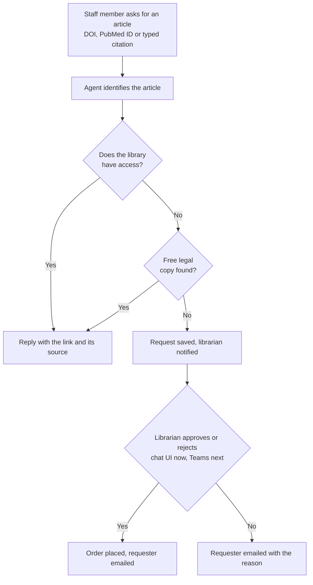
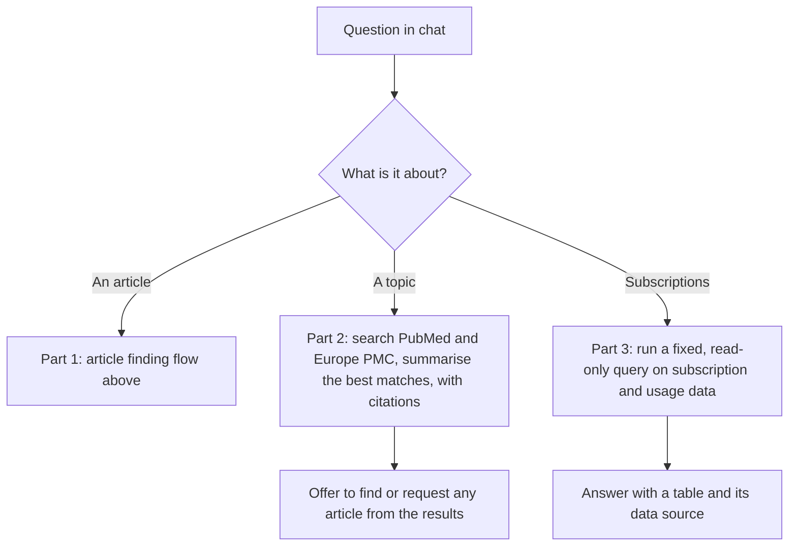
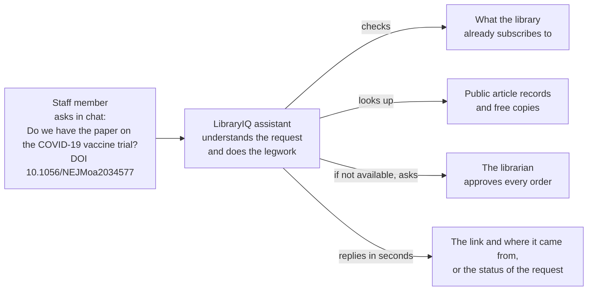
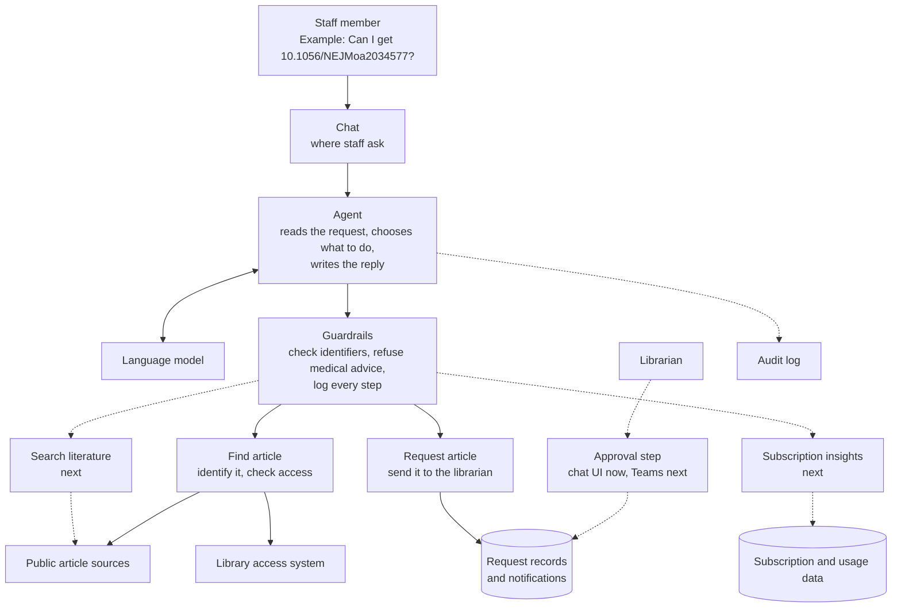

# LibraryIQ

A librarian-assisting agent: staff ask for an article in a chat, it tells them whether the library already has access and gives them the link, and only if not, sends a request that the librarian approves.

## The problem

Clinicians and researchers constantly need specific articles. Today a request goes to the librarian, who checks whether the library already subscribes, finds the link, or orders a copy. Most requests are the same few steps, repeated by hand, while the librarian's time is better spent on judgement calls.

LibraryIQ takes the routine part. Staff ask in a chat; the agent answers instantly when the library already has access, and only when it doesn't, passes a ready-made request to the librarian, who stays in charge of every order.

## What it covers

| Part | What it does | Systems used |
|---|---|---|
| 1. Article finding and ordering | From a DOI, a PubMed ID or a typed citation: identify the article, check whether the library has access, return the link or a free legal copy, or raise a request that the librarian approves | Crossref and PubMed (identify the article), EBSCO Full Text Finder (the library's link resolver, for the access check), Unpaywall (free copy), email (librarian and requester) |
| 2. Literature search | Find and summarise relevant papers on a topic, with citations and the search logic shown | PubMed and Europe PMC; CINAHL if the library's licence allows |
| 3. Subscription use and renewals | Answer questions such as which subscriptions renew soon and are barely used, and what each costs per use | Publisher usage reports in the COUNTER standard (EBSCO, Elsevier, Wolters Kluwer, Springer, with the full publisher list to follow), and the library's renewal and contract records |

## User flow



The requester can ask the agent for the status of a request at any time.

The other two parts (next) start from the same chat:



## Architecture

### The idea in one picture



The assistant does the routine checking. The librarian stays in charge of every order.

### How it works inside



The language model only reads the request and chooses a tool. The rules live in plain code, and each tool is small and does one thing.

Example:

1. A nurse asks: "Can I get 10.1056/NEJMoa2034577?"
2. The agent uses **Find article**, which identifies the paper from public records and checks the library's access list.
3. If the library has it, the agent replies with the link and its source. If not, it offers to send a request, and only sends it after the nurse agrees.
4. The librarian approves or rejects, and the nurse can ask for the outcome at any time (alerts and the Teams approval step are next).

## Built with

| Layer | Choice |
|---|---|
| Language | Python |
| Agent framework | [Microsoft Agent Framework](https://learn.microsoft.com/agent-framework/) |
| Model | A language model reached only through an AI gateway; the model route is to be confirmed |
| Tools | Agent Framework function tools that run inside the agent; each one is small and does one thing |
| Data | SQLite for local development; the production store is to be confirmed |
| Hosting | To be confirmed with the customer's platform team |
| Observability | An audit log of every tool call; tracing is planned |
| Infrastructure | Bicep ([infra/](infra/)) |

## Demo vs real

The demo runs against free public services and synthetic data. Systems that need a customer's own licence or credentials are replaced by a stand-in behind the same interface, so the real client drops in without changing the tools or the agent.

| Part | System | Real agent | Demo agent | Demo vs real | Findings |
|---|---|---|---|---|---|
| **1. Article finding** | Crossref, PubMed, Unpaywall | Live calls | Live calls | **Same** | Free public APIs, so the demo behaves exactly like the real agent. |
| **1. Article finding** | EBSCO Full Text Finder (LinkIQ API) | Real subscription check | Mock with the same response shape and synthetic journals | **Similar contract, fake data** | Documented REST API: `GET /{profile}/openurl`, with `id=doi:…` or `pmid:…`. The response has `targetLinks` with categories such as `FullText` and `ILL`. A customer profile (`customerid.groupid.profileid`) is required and no public profile exists. EBSCO has a developer registration and credentials request process; sandbox access was not confirmed. A second route, the Entitlement API, also needs a registered client app. No MCP server was found for either. **Real results are not possible without the customer or EBSCO.** |
| **2. Literature search** | PubMed | Scheduled ingest into Azure AI Search | Live search against PubMed and Europe PMC (planned) | **Similar** (live versus indexed) | Both are free public APIs. The demo skips the ingest and index step. |
| **2. Literature search** | CINAHL | Ingest, if the licence allows | Not in the demo | **Not possible** | EBSCO licensed database with no free access. The demo substitutes PubMed and Europe PMC. |
| **3. Subscription use and renewals** | Renewal spreadsheets and usage reports | The customer's own files | Synthetic COUNTER-shaped data (planned) | **Similar format, fake data** | COUNTER is the standard usage format, and a public COUNTER R5.1 API test server exists (not yet tried). The customer's real contract and cost data is **not possible**. |
| **3. Subscription use and renewals** | Publisher APIs (EBSCO, Elsevier, Wolters Kluwer, Springer) | Publisher credentials from the customer, later | A usage-report client built against the public test server (planned) | **Same code, no real publisher data** | Providers must support the COUNTER API standard, so one harvester fits all, but each publisher still needs the customer's credentials. **Real publisher data is not possible.** |

## Status

Part 1 (article finding) works end to end for two people: a requester and a librarian. The requester finds an article or raises a request and can ask for its status. The librarian lists pending requests and approves or declines each one, after confirming in the chat. The agent can never decide on its own. The access check, notifications and the request store are stand-ins. The model is reached through an AI gateway ([infra/](infra/)). Still to build: Teams as the channel, alerts to the librarian and requester, and Parts 2 and 3. Running the agent itself in Azure (as a hosted agent) is next.

## Run locally

Needs Python 3.13, [uv](https://docs.astral.sh/uv/) and an AI gateway (API Management) in front of a chat model deployment, as in [infra/](infra/). The agent never calls the model directly.

```bash
cp .env.example .env          # set the gateway URL and key, the model and a contact email
uv sync
uv run python -m libraryiq.cli    # chat in the terminal (add `librarian` to chat as the librarian)
uv run python -m libraryiq.ui     # chat UI on http://localhost:8080 with a requester and a librarian agent
uv run python -m libraryiq.main   # host the requester agent on http://localhost:8088 (Responses API)
uv run pytest
```

```bash
curl -s localhost:8088/responses -H "Content-Type: application/json" \
  -d '{"input": "Find 10.1056/NEJMoa2034577 for me"}'
```

The access check, email and request store are stand-ins (a sample journal list, a simulated notifier, SQLite). Crossref, PubMed and Unpaywall are called live.

### Try the two-user demo

Start the chat UI and open it in two browser windows. Pick **LibraryIQ requester** in one and **LibraryIQ librarian** in the other. Both agents share one request store, so a request raised by the requester shows up for the librarian.

1. Requester: ask for an article the library does not hold, for example `10.1093/eurheartj/ehaa944`, and agree to send a request.
2. Librarian: "What requests are waiting?", then "Approve it". Confirm in the prompt that appears.
3. Requester: "What happened to my request?"

The librarian can also check what is available, for example "Do we have 10.1056/NEJMoa2034577?".

The agent for each person is built with that person's identity and role. A requester is never given the librarian's tools, and the decision tool pauses for the librarian's confirmation before it runs. In the demo the two people are set in `.env`; in production the identity would come from the signed-in user.

## Code layout

| File | What it holds |
|---|---|
| `src/libraryiq/agent.py` | The agent: settings, instructions per role, model client |
| `src/libraryiq/tools.py` | The five tools as Agent Framework function tools, and the rules behind them, including who may do what |
| `src/libraryiq/lookup.py`, `access.py`, `orders.py` | Public lookups, the access check (stand-in), and request records with notifications (stand-in) |
| `src/libraryiq/audit.py` | Logs every tool call |
| `src/libraryiq/ui.py`, `cli.py`, `main.py` | Local chat UI with both agents, terminal chat, and the hosted agent |
| `evals/run_part1.py` | Scenarios graded in code, run against the real agents and model |

## Principles

- A human approves anything consequential, such as an external order.
- No patient data, and no clinical advice.
- Every answer shows where it came from.
- Every step is logged.
- Plain code for rules; the language model only where it adds value.

## Part 1 in brief: finding an article

A staff member gives a DOI, a PubMed ID or a typed citation. The agent identifies the article and checks whether the library already subscribes to it. If so, it returns the link. If not, it offers a request, and the librarian approves every external order.

| Step | System | Status |
|---|---|---|
| Identify the article from a DOI | Crossref | Public, free |
| Identify it from a PubMed ID or a title | PubMed | Public, free |
| Find a free legal copy | Unpaywall | Public, free (our addition, not requested by the library) |
| Check whether the library has access | EBSCO Full Text Finder, the library's link resolver; access works by recognising the hospital network | Confirmed as the system |
| Automate that check | EBSCO's API for the link resolver | To be confirmed |
| Approve every external order | The librarian | Confirmed |

## Part 2 in brief: literature search

A user asks for a literature search on a topic, for example diabetes management. The agent searches the library's sources and returns a ranked list with summaries, key findings and direct links. The user can refine the search, the agent shows its sources and search logic, and any article in the results can be found or requested through Part 1. The agent summarises evidence; it does not give clinical advice.

| Step | System | Status |
|---|---|---|
| Search biomedical literature | PubMed | Public, free |
| Search broader literature, with open-access full text where it exists | Europe PMC | Public, free |
| Search the library's subscribed databases | Not yet named by the library; CINAHL is a licensed database with no free access | To be confirmed |
| Show direct links to each article | The Part 1 access check | Reused from Part 1 |

How we would build it: start with live search of the public sources, check that every cited paper really appears in the results, and measure relevance against test searches written by the librarians. Whether to build a search index depends on what the licences allow.

## Part 3 in brief: subscription use and renewals

The librarian asks questions such as which subscriptions renew soon and are barely used, or what each costs per use. The agent answers with a table and names its data source. Today renewals run on email, spreadsheets and reminders. Contract and cost data is commercially sensitive, so this part is for the librarian only.

| Step | System | Status |
|---|---|---|
| Usage in a standard format | COUNTER reports; a public COUNTER test server exists for development | Public standard |
| Usage from each publisher | Publisher platforms (EBSCO, Elsevier, Wolters Kluwer, Springer; full list to follow), which tend to offer APIs | To be confirmed: needs the library's credentials |
| Renewal dates and contract costs | The library's spreadsheets and email today; a procurement system may take over | To be confirmed |
| Dashboards | Not yet chosen | To be confirmed |

How we would build it: fixed, read-only queries over one data store, role-gated to the librarian, built first on synthetic COUNTER-shaped data. Flagging upcoming renewals would be a scheduled check that sends alerts, not something the user has to ask for.

## Open questions to confirm

Part 1:

1. Does the library's EBSCO subscription include the link resolver API? If so: the profile ID, guest access or password, and sandbox access.
2. How is an article supplied when the library doesn't subscribe (document delivery supplier, interlibrary loan, other)?
3. Does the librarian approve every order, or only those above a cost limit? Who else may approve, and who covers absence?
4. Do links work for staff outside the hospital network, including the librarian?
5. Working assumption: the librarian approves or rejects in Teams, on a card with Approve and Reject buttons. Is Teams available to the librarian and to staff, and can the app be installed for them? Does the library already use an approvals tool such as Power Automate?
6. May lookups to public services leave the hospital environment? Only a DOI or title would go out, never user details.
7. How do staff sign in, and does anything depend on who the user is?
8. Has the business owner confirmed article finding as the first part?

Part 2:

1. Which databases and sources are in scope, beyond PubMed and Europe PMC? Is CINAHL included, and does the library have an API for it?
2. Do the publisher licences allow caching or indexing of content? This decides live search versus a search index.
3. Should summaries use abstracts only, or full text where the library has access?
4. Which refinements do users need (date, study type, population, language)?
5. How is relevance judged? Can the librarians supply a set of test searches with the results they would expect?
6. Where is the line between summarising evidence and giving clinical advice, and how should the agent respond when asked for the latter?

Part 3:

1. Where do usage and contract data live today (spreadsheets, a procurement or contract system), and can they be exported?
2. Which publishers' usage reports can the library access, and who holds the credentials? What is the full publisher list?
3. Who may see contract and cost data? Only the librarian?
4. Should renewals be flagged proactively (who is alerted, and how far ahead) or only when someone asks?
5. How is cost per use defined, and what cost data exists for each resource?
6. Which dashboards or answers does library management need, and in which tool?
7. When the supply chain team takes over renewals, should the agent connect to their system?
