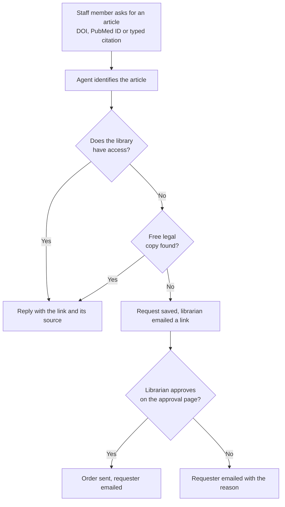
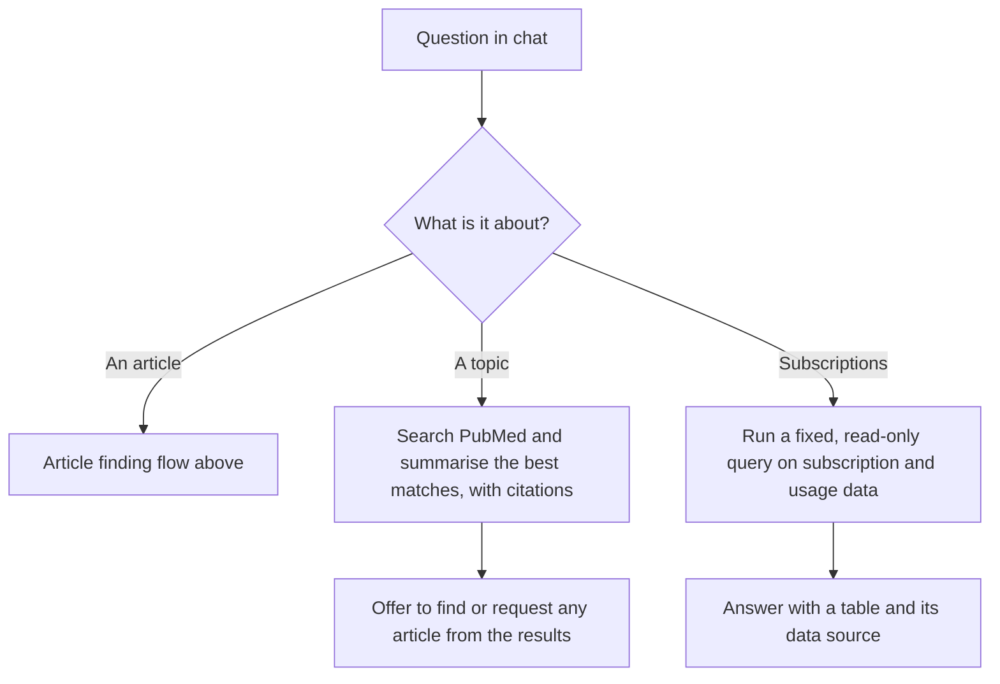
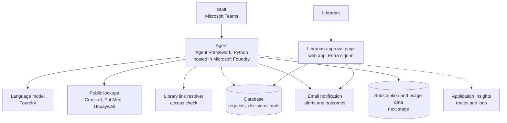
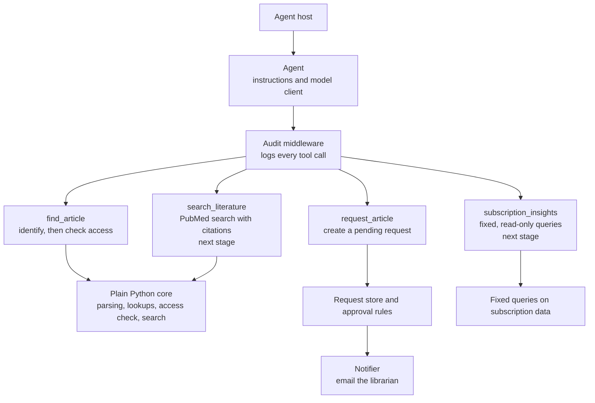

# LibraryIQ

A librarian-assisting agent: staff ask for an article in Teams, it tells them whether the library already has access and gives them the link, and only if not, sends a request that the librarian approves.

## The problem

Clinicians and researchers constantly need specific articles. Today a request goes to the librarian, who checks whether the library already subscribes, finds the link, or orders a copy. Most requests are the same few steps, repeated by hand, while the librarian's time is better spent on judgement calls.

LibraryIQ takes the routine part. Staff ask in a chat; the agent answers instantly when the library already has access, and only when it doesn't, passes a ready-made request to the librarian, who stays in charge of every order.

## What it covers

| Part | What it does | Stage |
|---|---|---|
| Article finding | From a DOI, a PubMed ID or a typed citation: identify the article, check access, return the link or raise a request | First |
| Literature search | Find and summarise relevant papers, with citations | Next |
| Subscription use and renewals | Answer questions such as which subscriptions renew soon and are barely used | Next |

## User flow

The requester can also ask the agent for the status of a request at any time.

The other two parts (next) start from the same chat:

## Architecture

Inside the agent, the language model only reads the request and chooses a tool. The rules live in plain code.

## Built with

| Layer | Choice |
|---|---|
| Language | Python |
| Agent framework | [Microsoft Agent Framework](https://learn.microsoft.com/agent-framework/) |
| Runtime and model | Microsoft Foundry (hosted agent, model deployment) |
| Data | Azure SQL; SQLite for local development |
| Observability | OpenTelemetry to Application Insights |
| Infrastructure | Bicep ([infra/](infra/)) |

## Demo vs real

The demo runs against free public services and synthetic data. Systems that need a customer's own licence or credentials are replaced by a stand-in behind the same interface, so the real client drops in without changing the tools or the agent.

| Part | System | Real agent | Demo agent | Demo vs real | Findings |
|---|---|---|---|---|---|
| **1. Article finding** | Crossref, PubMed, Unpaywall | Live calls | Live calls | **Same** | Free public APIs, so the demo behaves exactly like the real agent. |
| **1. Article finding** | EBSCO Full Text Finder (LinkIQ API) | Real subscription check | Mock with the same response shape and synthetic journals | **Similar contract, fake data** | Documented REST API: `GET /{profile}/openurl`, with `id=doi:…` or `pmid:…`. The response has `targetLinks` with categories such as `FullText` and `ILL`. A customer profile (`customerid.groupid.profileid`) is required and no public profile exists. EBSCO has a developer registration and credentials request process; sandbox access was not confirmed. A second route, the Entitlement API, also needs a registered client app. No MCP server was found for either. **Real results are not possible without the customer or EBSCO.** |
| **2. Literature search** | PubMed | Scheduled ingest into Azure AI Search | Live search against PubMed and Europe PMC | **Similar** (live versus indexed) | Both are free public APIs. The demo skips the ingest and index step. |
| **2. Literature search** | CINAHL | Ingest, if the licence allows | Not in the demo | **Not possible** | EBSCO licensed database with no free access. The demo substitutes PubMed and Europe PMC. |
| **3. Subscription use and renewals** | Renewal spreadsheets and usage reports | The customer's own files | Synthetic COUNTER-shaped data | **Similar format, fake data** | COUNTER is the standard usage format, and a public COUNTER R5.1 API test server exists (not yet tried). The customer's real contract and cost data is **not possible**. |
| **3. Subscription use and renewals** | Publisher APIs (EBSCO, Elsevier, Wolters Kluwer, Springer) | Publisher credentials from the customer, later | A usage-report client built against the public test server | **Same code, no real publisher data** | Providers must support the COUNTER API standard, so one harvester fits all, but each publisher still needs the customer's credentials. **Real publisher data is not possible.** |

## Status

Early build. A private, end-to-end environment is defined in [infra/private/](infra/private/) and development happens on a jump VM inside it; the agent code is next. A Get Started guide will follow once there is something to run.

## Principles

- A human approves anything consequential, such as an external order.
- No patient data, and no clinical advice.
- Every answer shows where it came from.
- Every step is logged.
- Plain code for rules; the language model only where it adds value.
